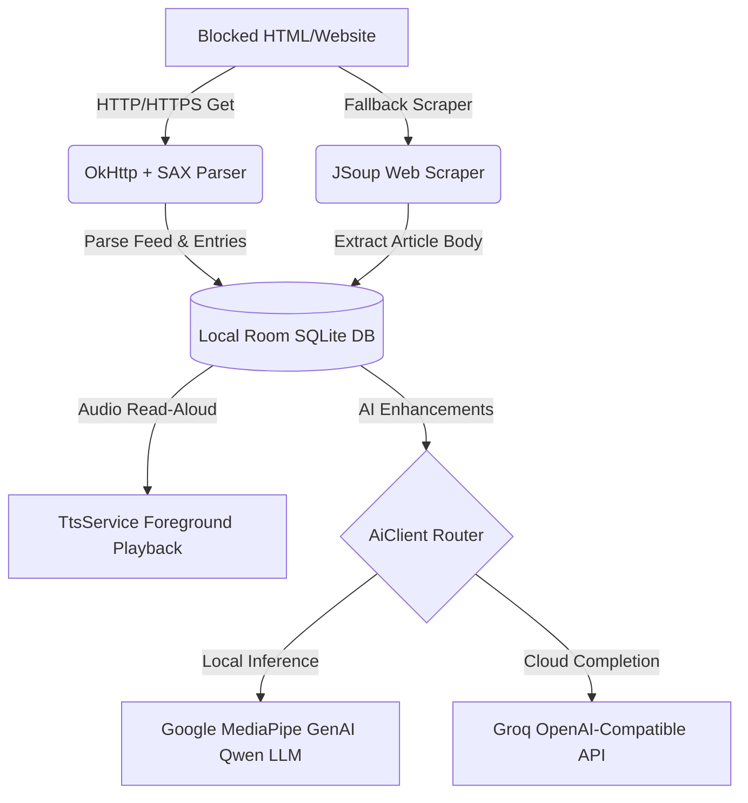
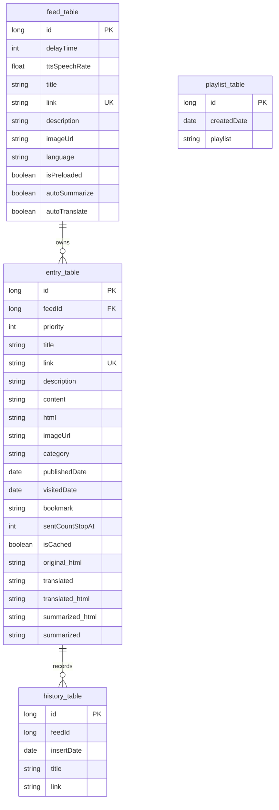
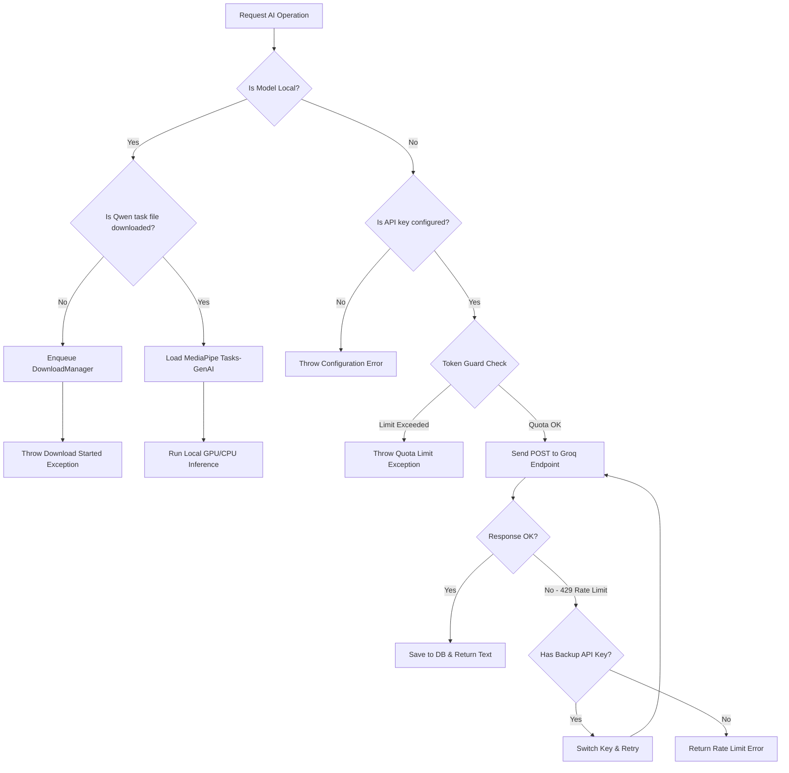

# Chapter 5: Implementation

The purpose of the implementation chapter is to give the reader a clear picture of how the RSSNewsReader application was developed, configured, and deployed. It details the technical stack, database implementation, key modules, API integration, and security controls, and outlines the technical challenges resolved during the development lifecycle.

---

## 5.1 Deployment
The RSSNewsReader application is deployed as a native mobile client for Android devices. The implementation scope encompasses a client-side, offline-first application model that integrates local databases, cloud AI endpoints, on-device machine learning, and background services to offer a seamless, eyes-free reading experience.

### Main Modules and Objective Mapping

| Module Name | Core Implementation Files | Mapping to System Objectives |
| :--- | :--- | :--- |
| **RSS Reader & Parser** | `RssReader`, `RssHandler`, `WebFeedReader` | Dynamically fetches and parses RSS/Atom XML feeds or scrapes standard HTML pages when RSS is unavailable. |
| **Database & Caching** | `AppDatabase`, `FeedDao`, `EntryDao` | Implements offline storage for feed metadata, downloaded articles, reading progress, and playlist logs. |
| **Text-to-Speech (TTS) Service** | `TtsService`, `TtsPlayer`, `TtsPlaylist` | Synthesizes article content into audio, functioning as a foreground service with media session controls and Bluetooth support. |
| **AI Integration Engine** | `AiClient`, `LocalLlmManager`, `TokenUsageGuard` | Handles translation and summarization using Groq cloud APIs or an on-device Qwen LLM via Google MediaPipe. |
| **Full-Text Extractor & Ad Blocker** | `TtsExtractor`, `AdBlocker` | Scrapes raw webpages to extract article bodies using Readability4J and blocks third-party ad/tracker resources. |
| **Background Sync Controller** | `RssWorkManager`, `RssWorker`, `PreloadWorker` | Automates background preloading, periodic synchronization, and queued AI translation/summarization tasks. |

---

## 5.2 Development Environment

### 5.2.1 Programming Languages Used
* **Java (JDK 17):** The main programming language used to develop all application logic, database interfaces, UI controllers, and background services.
* **XML (Extensible Markup Language):** Used to define Android user interface layouts, resource styles, Vector Drawables, navigation graphs, and network configurations.
* **Groovy (Gradle Build Tool):** Used to configure the build scripts (`build.gradle`), define compilation targets, and manage dependency declarations.

### 5.2.2 Frameworks and Libraries
* **Android Jetpack Components:**
  * *Room Database (v2.8.4):* SQLite Object Relational Mapping (ORM) library with RxJava3 integration for robust, thread-safe database operations.
  * *WorkManager (v2.11.2):* Scheduling framework for executing deferrable, guaranteed background tasks (preloading, auto-translation).
  * *Navigation Component (v2.9.8):* Simplifies screen transition animations and fragment transaction routing.
  * *View Binding:* Generates binding classes for layout files to eliminate `findViewById` boilerplate and compile-time null-safety checks.
* **Networking & Parsing Libraries:**
  * *Retrofit2 (v3.0.0) & OkHttp3 (v5.4.0):* Handles REST API communications and HTTP network calls with connection pooling, caching, and custom timeouts.
  * *JSoup (v1.22.2) & Readability4J (v1.0.8):* Used to scrape full article HTML content, extract clean read-aloud bodies, and sanitize text.
* **AI & Machine Learning:**
  * *MediaPipe Tasks-GenAI (v0.10.35):* Powers local, on-device Large Language Model (LLM) execution.
  * *Google ML Kit Language ID (v17.0.6):* Identifies the language of downloaded articles to coordinate automatic translation workflows.
* **Utilities & UI Enhancements:**
  * *Picasso (v2.71828):* Asynchronously loads and caches feed channel and article images.
  * *Timber (v5.0.1):* Structured logging framework for capturing operational logs and exception traces.
  * *TapTargetView (v1.15.0):* Provides feature discovery and user onboarding walkthroughs.

### 5.2.3 IDEs and Tools
* **Android Studio (Ladybug / Koala):** The primary integrated development environment used for code editing, layout previews, virtual device management, and debugging.
* **Android SDK Build Tools (v37):** Used to compile Java sources and package them into APK/AAB bundles.
* **Android Virtual Device (AVD):** Emulators configured with different API levels (API 29 to API 35) to perform responsive design checks and background execution tests.

### 5.2.4 Version Control System
* **Git:** Used locally for version control, branching, and commit management.
* **GitHub:** Host platform for remote repository synchronization, issue tracking, and version release storage (`TheINSANE333/RSSNewsReader2025`).

### 5.2.5 Operating System Used
* **Windows 11 (64-bit):** The development host operating system.
* **Android 10.0 (API Level 29 - Min SDK) to Android 15.0 (API Level 35+):** The target mobile runtime environment.

---

## 5.3 System Configuration and Setup



### 5.3.1 Backend Setup
The application follows a local-first, decentralized serverless model. It does not require a custom backend server. Instead:
1. **Third-Party API Integration:** The app integrates directly with the **Groq Cloud API** (`https://api.groq.com/openai/v1/`) as its default Large Language Model engine.
2. **Local Middleware:** Retrofit acts as the local service interface translator, routing local request models to external HTTP endpoints.
3. **Local Database:** Room Database compiles schemas directly into an embedded SQLite database inside the private app directory, requiring no database server setup.

### 5.3.2 Frontend Setup
The application is structured around a single-activity architecture (`MainActivity`) with modular `Fragment` components swapped dynamically via the Navigation Component. 
* **UI Themes:** Implements a dynamic light and dark theme using Android AppCompatDelegate configurations.
* **Material Design 3 Integration:** Uses components like `RecyclerView` (to display article feeds smoothly), `BottomNavigationView` (for tab navigation), and `BottomSheetDialog` (for contextual actions).
* **WebView Configurations:** Configures WebKit engines with JavaScript controls, offline page saving, and custom headers.

### 5.3.3 Build Tools and Package Managers
Gradle manages building, compiling, and resolving dependencies. The `app/build.gradle` file defines all target versions, compiler flags, and annotations processing arguments (such as exporting Room schema locations).

---

## 5.4 Database Implementation

### 5.4.1 Database Schema Design
The relational schema is implemented locally using Android Room SQLite ORM. The database contains four tables to track feeds, downloaded entries, custom reading playlists, and listening history.



### 5.4.2 SQLite Database Tables

#### Table: `feed_table` (Stores RSS feed channels)
| Column Name | SQLite Data Type | Constraints / Attributes | Description |
| :--- | :--- | :--- | :--- |
| `id` | INTEGER | PRIMARY KEY AUTOINCREMENT | Unique ID of the feed channel |
| `link` | TEXT | UNIQUE, NOT NULL | The source RSS URL of the feed |
| `title` | TEXT | | Title of the feed channel |
| `description`| TEXT | | Description of the channel |
| `imageUrl` | TEXT | | Link to the feed channel icon |
| `language` | TEXT | | Primary language of the feed channel |
| `delayTime` | INTEGER | DEFAULT 0 | Custom delay (in ms) for TTS pause |
| `ttsSpeechRate`| REAL | DEFAULT 1.0 | Custom speech rate speed for TTS |
| `isPreloaded` | INTEGER | DEFAULT 0 (Boolean) | Flag to preload articles offline |
| `autoSummarize`| INTEGER | DEFAULT 1 (Boolean) | Auto-summarize new entries |
| `autoTranslate`| INTEGER | DEFAULT 1 (Boolean) | Auto-translate new entries |

#### Table: `entry_table` (Stores downloaded articles)
| Column Name | SQLite Data Type | Constraints / Attributes | Description |
| :--- | :--- | :--- | :--- |
| `id` | INTEGER | PRIMARY KEY AUTOINCREMENT | Unique ID of the article |
| `feedId` | INTEGER | FOREIGN KEY (`feed_table`.`id`) | Owner feed channel |
| `link` | TEXT | UNIQUE WITH `feedId` | URL link to the original article |
| `title` | TEXT | | Title of the article |
| `description`| TEXT | | Short description/snippet |
| `content` | TEXT | | Extracted full text of the article |
| `html` | TEXT | | Extracted body HTML code |
| `imageUrl` | TEXT | | Link to article banner image |
| `publishedDate`| INTEGER | Date stored as Long timestamp | Publication timestamp |
| `visitedDate`| INTEGER | Date stored as Long timestamp | When the user viewed the article |
| `priority` | INTEGER | DEFAULT 0 | Ordering priority rank |
| `bookmark` | TEXT | DEFAULT '' | Saved bookmark bookmark position |
| `isCached` | INTEGER | DEFAULT 0 (Boolean) | Extracted readability cache flag |
| `original_html`| TEXT | | Backed-up raw scraped page HTML |
| `translated` | TEXT | NULLABLE | AI-translated text content |
| `translated_html`| TEXT | NULLABLE | AI-translated HTML content |
| `summarized` | TEXT | NULLABLE | AI-summarized text content |
| `summarized_html`| TEXT | NULLABLE | AI-summarized HTML content |

### 5.4.3 DAO Queries and Database Triggers
Room compiles Java interfaces into SQL commands. Because Room runs on SQLite, custom SQL query optimizations are written inside the Data Access Objects (DAOs):

```java
@Dao
public interface EntryDao {
    @Insert(onConflict = OnConflictStrategy.IGNORE)
    long insert(Entry entry);

    @Query("SELECT * FROM entry_table WHERE id = :id LIMIT 1")
    Entry getEntryById(long id);

    @Query("UPDATE entry_table SET isCached = 1, content = :content, html = :html WHERE id = :id")
    void updateCachedContent(long id, String content, String html);

    @Query("DELETE FROM entry_table WHERE feedId = :feedId")
    void deleteEntriesByFeedId(long feedId);
}
```

#### Database Schema Migrations
The database schema has evolved to accommodate new features. Custom SQLite triggers are declared within database migrations (such as version 7 to 8) to automatically delete duplicates and enforce index constraints:

```java
public static final Migration MIGRATION_7_8 = new Migration(7, 8) {
    @Override
    public void migrate(@NonNull SupportSQLiteDatabase database) {
        // Delete duplicate records before creating unique index
        database.execSQL("DELETE FROM entry_table WHERE id NOT IN (SELECT MIN(id) FROM entry_table GROUP BY feedId, link)");
        database.execSQL("DELETE FROM feed_table WHERE id NOT IN (SELECT MIN(id) FROM feed_table GROUP BY link)");
        
        // Apply unique constraint indexes
        database.execSQL("CREATE UNIQUE INDEX IF NOT EXISTS index_entry_table_feedId_link ON entry_table (feedId, link)");
        database.execSQL("CREATE UNIQUE INDEX IF NOT EXISTS index_feed_table_link ON feed_table (link)");
    }
};
```

---

## 5.5 Key Modules and Features Developed

### 5.5.1 RSS Feed Reader & Auto-Discovery Module
* **Feature:** Fetches web URLs and extracts structured news feeds. It supports standard RSS/Atom parsing, directory URL guessing, auto-discovery via HTML link headers, and fallback web scraping for pages without native feeds.
* **Pseudocode Algorithm:**
```text
FUNCTION fetchAndParseFeed(inputUrl)
    trimmedUrl = formatUrlSecure(inputUrl)
    TRY
        // Tier 1: Try parsing direct XML
        feedResult = parseXmlFeed(trimmedUrl)
        IF feedResult is NOT empty:
            RETURN feedResult
    CATCH exception
        LOG "Direct XML parse failed, trying fallbacks..."

    // Tier 2: Try Web Scraping
    TRY
        scrapedFeed = runWebScraper(trimmedUrl)
        IF scrapedFeed is NOT empty:
            RETURN scrapedFeed
    CATCH exception

    // Tier 3: Probe common RSS URL endpoints
    TRY
        commonUrl = probeCommonPatterns(trimmedUrl) // e.g. /feed/, /rss.xml
        IF commonUrl exists:
            RETURN parseXmlFeed(commonUrl)
    CATCH exception

    // Tier 4: Look for <link rel="alternate"> in HTML header
    TRY
        discoveredUrl = searchHtmlLinkTags(trimmedUrl)
        IF discoveredUrl exists:
            RETURN parseXmlFeed(discoveredUrl)
    CATCH exception

    THROW "Failed to parse feed. No valid RSS source discovered."
END FUNCTION
```
* **Code Snippet (`RssReader.java`):**
```java
// Executing the fallback sequence when direct parser fails
try {
    RssFeed feed = parseDirectFeed(rssUrl);
    if (feed != null && !feed.getRssItems().isEmpty()) {
        return feed;
    }
    throw new Exception("Feed is empty");
} catch (Exception e) {
    // Fallback Tier: HTML Scraper
    WebFeedReader webFeedReader = new WebFeedReader(rssUrl);
    RssFeed scrapedFeed = webFeedReader.getFeed(limit);
    if (scrapedFeed != null) return scrapedFeed;
    ...
}
```

### 5.5.2 AI Translation & Summarization Engine (Groq & MediaPipe)
* **Feature:** Provides context-aware translation and structured text summarization of downloaded articles. It routes requests either to cloud-based Groq endpoints or local on-device LLMs (Qwen 1.5B) based on configuration.
* **Flow Logic:**

* **Code Snippet (`AiClient.java`):**
```java
if ("local_qwen_2_5_1_5b".equals(model)) {
    StringBuilder promptBuilder = new StringBuilder();
    for (Message msg : messages) {
        promptBuilder.append("<|im_start|>").append(msg.role).append("\n");
        promptBuilder.append(msg.content).append("<|im_end|>\n");
    }
    promptBuilder.append("<|im_start|>assistant\n");
    return LocalLlmManager.getInstance(context).generateResponse(context, promptBuilder.toString(), model);
}
```

### 5.5.3 Foreground Text-to-Speech Playback Service
* **Feature:** Provides high-quality background audio playback of news articles. Implements a foreground service using Android's media framework, allowing background execution, lock screen controls, and hardware button listeners.
* **Code Snippet (`TtsService.java`):**
```java
@Override
public void onCreate() {
    super.onCreate();
    ttsNotification = new TtsNotification(this);
    ComponentName mbrComponent = new ComponentName(getPackageName(), TtsMediaButtonReceiver.class.getName());
    mediaSession = new MediaSessionCompat(this, TAG, mbrComponent, null);
    
    // Define transport control callbacks for background/hardware buttons
    mediaSession.setFlags(MediaSessionCompat.FLAG_HANDLES_MEDIA_BUTTONS |
                          MediaSessionCompat.FLAG_HANDLES_TRANSPORT_CONTROLS);
    mediaSession.setCallback(callback);
    
    // Link service to notification for lock screen media widget integration
    setSessionToken(mediaSession.getSessionToken());
    ttsPlayer.initTts(this, new TtsPlayerListener(), callback);
}
```

### 5.5.4 Ad-Blocking & HTML Readability Sanitizer
* **Feature:** Scrapes articles to filter out layout styling, scripts, trackers, and advertisements, extracting only clean text and layout structures for TTS reading or reader view display.
* **Code Snippet (`AdBlocker.java`):**
```java
public static boolean isAd(String url) {
    if (url == null || url.isEmpty()) return false;
    for (String domain : AD_DOMAINS) {
        if (url.contains(domain)) {
            Timber.d("Blocking ad/tracker: " + url);
            return true;
        }
    }
    return false;
}
```

---

## 5.6 APIs and Integration

### 5.6.1 Description of Third-Party APIs Used
The application communicates with the **Groq API** (an OpenAI-compatible chat completion service). Groq hosts high-speed open models (such as `llama-3.3-70b-versatile` and `gemma2-9b-it`). The API keys are supplied dynamically by the user via the settings panel and saved to secure Preferences.

### 5.6.2 API Endpoints Implemented
* **Chat Completions Endpoint:**
  * `POST https://api.groq.com/openai/v1/chat/completions`
  * Executed asynchronously using Retrofit with custom network parameters.

### 5.6.3 JSON Payload Structure

#### Request Body Payload Example:
```json
{
  "model": "llama-3.3-70b-versatile",
  "temperature": 0.0,
  "max_tokens": 6000,
  "messages": [
    {
      "role": "system",
      "content": "You are a professional news translator. Translate the text to English."
    },
    {
      "role": "user",
      "content": "Hier ist eine Nachricht..."
    }
  ]
}
```

#### Response Body Payload Example:
```json
{
  "choices": [
    {
      "index": 0,
      "message": {
        "role": "assistant",
        "content": "Here is a news article..."
      },
      "finish_reason": "stop"
    }
  ],
  "usage": {
    "prompt_tokens": 150,
    "completion_tokens": 200,
    "total_tokens": 350
  }
}
```

### 5.6.4 Authentication Mechanisms
The application utilizes **Bearer Token Header Authentication**. 
During initialization, the client interceptor injects the authorization token in the request headers:
```http
Authorization: Bearer <user_configured_groq_api_key>
HTTP-Referer: https://github.com/TheINSANE333/RSSNewsReader2025
X-Title: RSS News Reader 2025
Content-Type: application/json
```

---

## 5.7 Network Configuration

The network capabilities are managed using a robustly configured OkHttpClient:
* **Timeouts:** Configured with connection, read, and write timeouts of **300 seconds** for API endpoints to prevent socket disconnect errors during intensive summarization tasks on large articles.
* **Network Security Configuration:** Declared in `AndroidManifest.xml` via `network_security_config.xml`. This configuration enforces strict HTTPS for all API connections while allowing fallback cleartext HTTP traffic for older legacy RSS blog channels:
```xml
<?xml version="1.0" encoding="utf-8"?>
<network-security-config>
    <domain-config cleartextTrafficPermitted="true">
        <!-- Allow HTTP for legacy RSS Feeds -->
        <domain includeSubdomains="true">http</domain>
    </domain-config>
    <base-config cleartextTrafficPermitted="false">
        <!-- Default strict HTTPS for APIs -->
    </base-config>
</network-security-config>
```

---

## 5.8 Security Measures

### 5.8.1 Input Validation & HTML Sanitization
* **HTML Sanitization:** Raw webpage content fetched by JSoup is parsed and sanitized against whitelist schemas to strip nested scripts (`<script>`), active styles, and embed frames. This prevents Cross-Site Scripting (XSS) injection vectors inside WebViews.
* **Secure API Storage:** API keys are stored in private `SharedPreferences` that are inaccessible to other applications.

### 5.8.2 Access Control and Token Usage Guard
* **Token Usage Guard:** To protect users from excessive charges on their developer keys, a client-side `TokenUsageGuard` tracks token quotas locally.
* If the token count exceeds the safe thresholds, the app blocks outgoing requests, prompts warning messages, and resets the daily limits.

### 5.8.3 Exception Handling and Logging
* **Robust Logging:** Handled via the Timber framework. Build-sensitive logging is disabled in production release compilations (`HttpLoggingInterceptor.Level.NONE`).
* **Graceful Degradation:** All core networking operations wrap in strict try-catch handlers that return custom error states (e.g., automatically switching to backup API keys on HTTP 429 Rate Limit responses).

---

## 5.9 Challenges Encountered and Solutions

### 5.9.1 Challenges Encountered
1. **Paywall Scraper Blocking:** Major news sites blocks standard HTML scraper libraries (returning HTTP `403 Forbidden` errors), preventing offline article caching.
2. **Cloud LLM Cost & Rate Limits:** Cloud-based APIs frequently return `429 Too Many Requests` when background sync tasks attempt to auto-summarize multiple incoming entries.
3. **Foreground Service Life Cycle Restrictions:** Strict Android Oreo (API 26) and Q (API 29) system updates cause service crashes when background tasks attempt to launch the background audio playback player without displaying immediate user-visible notifications.
4. **Database Schema Corruption During Migrations:** Adding new features across version upgrades corrupted database tables and user settings when database migrations were not mapped correctly.

### 5.9.2 Solutions Implemented
1. **Multi-Tier Fallback Parsing Engine:** Developed a tiered fetching routine. If Jsoup web scraping fails, the system falls back to auto-discovering header link headers or matching common WordPress/Blogger feed directories (e.g., `/feed/`).
2. **On-Device LLM Integration & Key Auto-Switching:** 
   * Configured **Google MediaPipe GenAI** to download and execute Qwen 1.5B tasks locally, removing API fees and dependency on internet networks.
   * Built a key-rotation mechanism inside `AiClient` to automatically switch API keys upon receiving a `429` error.
3. **Immediate Media Notification Binding:** Configured `TtsService.onStartCommand` to bind to the foreground lifecycle within 5 seconds by displaying a persistent, system-integrated notification loaded with media session details.
4. **Custom Migration Scripting:** Replaced Room's destructive fallback migrations with written, incremental migrations (v2 through v8). Handled SQLite cleanups and unique index constraint definitions manually to resolve conflicts before creating unique indices.

---

## 5.10 Summary

The implementation of the RSSNewsReader application aligns with the initial design goals of establishing a local-first, offline-first, and eyes-free information reader. By leveraging Dagger Hilt for modular configuration, Room for persistent local caching, a multi-tier parsing engine, a background TTS service, and a hybrid local/cloud AI processor, the system successfully addresses the constraints of network latency and accessibility. 

Future improvements will focus on:
1. Enhancing on-device NLP by upgrading the local task model to a larger model (e.g., Qwen 2.5 3B or Gemma 2 2B) as mobile GPU acceleration options mature.
2. Implementing custom CSS styling templates for the WebView reader display.
