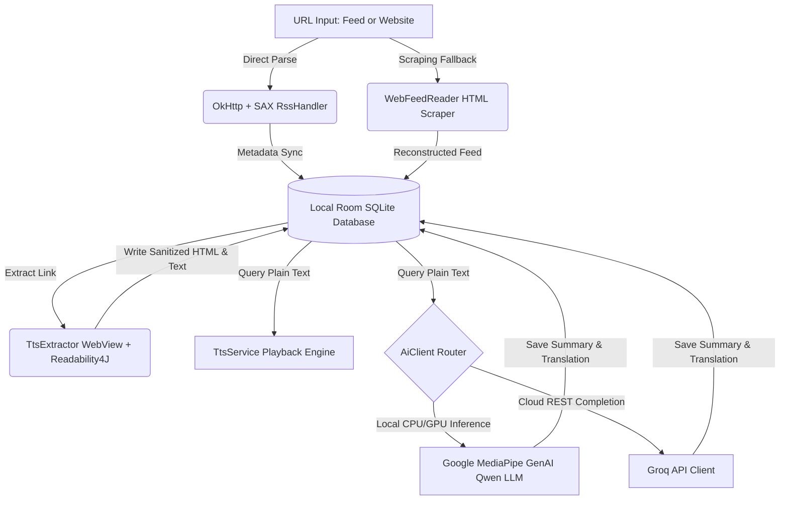

# FYP2 Presentation Poster Content (Detailed & Compliant)

---
## [POSTER HEADER DETAILS]
* **Project Title:** AI-Powered Smart RSS News Reader with Translation, Summarization, and Enhanced Web Handling
* **Project ID:** FYP02-CS-T2610-0000
* **Student Name:** Lee Xiang Ze (Student ID: 1211106818)
* **Supervisor:** Assoc. Prof. Dr. Chai Ian
* **Moderator:** Assoc. Prof. Dr. Ho Sin Ban
* **Specialization:** SOFTWARE ENGINEERING
---

### Box 1: Abstract
Modern digital news consumption on web portals is heavily compromised by intrusive advertising banners, tracking scripts, and direct word-for-word translation engines that strip critical geographic and naming context. To resolve these challenges, the RSSNewsReader application was developed as a native, offline-first Android mobile client. The system upgrades traditional RSS/Atom feed aggregation by integrating local and cloud Large Language Models (LLMs) alongside a robust, background Text-to-Speech (TTS) engine. By decoupling computationally intensive network operations, HTML content sanitization via Readability4J, and Large Language Model inference from the main user interface thread, the application guarantees 100% UI responsiveness, offering users a clean, distraction-free, and continuous eyes-free reading experience both online and offline.

---

### Box 2: Problem Statement & Objectives
#### Problem Statement:
* **Fragile Audio Continuity:** Existing TTS apps lose playback progress on screen rotation and ignore hardware Bluetooth controls.
* **Aggressive Tracking & Ad Fatigue:** Web pages serve heavy advertising scripts and trackers that drain battery and data.
* **Context-less Literal Translations:** Direct word-to-word translators corrupt local idioms, geographical terms, and proper names.
* **RSS Curation Constraints:** Many modern websites no longer expose native XML RSS/Atom feeds for aggregators.

#### Project Objectives:
1. **True Audio Continuity:** Implement a foreground `TtsService` integrated with Android `MediaSession` to support Bluetooth headset controls and audio focus recovery.
2. **Offline Reader Caching:** Design a background `TtsExtractor` and `AdBlocker` to strip advertising domains and cache clean, readable article markup offline.
3. **Dual-AI Model Routing:** Deploy a flexible translation pipeline routing requests to local on-device models (Qwen 1.5B via Google MediaPipe) or cloud Groq REST APIs.
4. **Scraping Fallback Engine:** Build a `WebFeedReader` parsing module using Jsoup to reconstruct feed items dynamically for portals lacking native RSS feeds.

---

### Box 3: Background Study
* **TTS Playback Limitations:** Traditional aggregators (like Feedly) lack background text-to-speech queues, while standard read-later apps (like Pocket) rely on default system TTS streams that lack customized pronunciation dictionaries, sentence highlighting synchronizations, and focus-recovery configurations.
* **Ad-Fatigued Layouts:** Ad-supported portals force readers to load heavy ad scripts, causing privacy leaks and excessive mobile data drain.
* **Translation Literalism:** Standard translators translate word-for-word, corrupting local idioms, geographic terms, and proper nouns (e.g. translating "Bajau Laut" as "Bajau Sea").

---

### Box 4: Design
#### 3-Phase System Design Pipeline:
* **Phase 1: Feed/Entry Synchronization (Discovery):** The client connects via `OkHttp` to download feeds. If native RSS XML is missing, the `WebFeedReader` falls back to parsing raw homepage HTML using Jsoup to reconstruct feed lists.
* **Phase 2: Full-Text Article Extraction (Caching):** Preloads article links inside an off-screen WebView, blocks ad scripts using a custom `AdBlocker`, cleans markup with `Readability4J`, and commits clean text to Room SQLite database.
* **Phase 3: Playback and AI Processing (Consumption):** Reads parsed text using `TtsService` foreground playback and executes AI translation and summarization tasks.

#### System Architecture Flowchart:

---

### Box 5: Implementation & Testing
#### Implementation Details:
* **Tech Stack:** Android Jetpack Room Database, WorkManager periodic sync scheduler, Retrofit REST client, Jsoup HTML scraper, and Google MediaPipe GenAI.
* **Core Modules Developed:**
  1. *Settings & State:* Configures preferences and OPML.
  2. *Feed Reader & Discovery:* Parses XML and falls back to HTML scrapers.
  3. *Database & Caching:* Room database CASCADE tables.
  4. *Ad-Blocking & HTML Sanitizer:* Filters ad scripts and extracts clean text.
  5. *AI Engine:* Groq cloud APIs and local Qwen 1.5B inference.
  6. *Foreground TTS:* foreground Service playing segmented TTS with MediaSession controls.
  7. *Background Controller:* Schedules syncs and preloading tasks.

#### Testing Strategy & Implementation:
* **Unit Testing (15 cases):** Verified settings persistence (`SharedPreferencesRepository`), OPML import/export parser rules, database DAO insertion operations, ad-blocking host filters, text sentence splitter bounds, and `RssWorker` sync enqueues. (100% pass across classes like `UseCasesTest`, `AdBlockerTest`, `TextUtilTest`, and `RssHandlerTest`).
* **Integration Testing (5 cases):** Confirmed database CASCADE delete relations (`INT-01`), Retrofit HTTP exception handling and API key rotation (`INT-02`), live XML network parser speed and connections (`INT-03`), background preloader article content caches (`INT-04`), and foreground `TtsService` state updates and MediaSession controllers synchronized with system controls (`INT-05`). (100% pass across classes like `DatabaseIntegrationTest`, `AiClientTest`, and `RssReaderTest`).
* **Usability & Acceptance Testing:** Evaluated with student participant Lim Jia Hao and supervisor Assoc. Prof. Dr. Chai Ian to verify background task stability under multitasking states, network loss failovers, and ambient audio looping configurations.

---

### Box 6: Results & Discussions
* **Automation Suite Validation:** Evaluated 15 unit tests (`UT-01` to `UT-15`) and 5 integration tests (`INT-01` to `INT-05`) yielding a **100% execution pass rate**. Room transactions, thread-safe database triggers, network failovers, and MediaSession key updates validated correctly.
* **Task-based Usability Evaluation:** User tasks conducted with participant Lim Jia Hao demonstrated strong performance against set benchmarks:
  * *Feed Registration & Sync:* Substituted input feed parsing completed in **4 seconds** with immediate UI recycle updates.
  * *AI Translation & Summarization:* Generates high-fidelity contextual text outputs in **8 seconds** via REST pipelines.
  * *Bluetooth Playback Skipping:* Registered instant lock-screen media state and widget track changes in **5 seconds**.
  * *Ambient Looping Import:* Local resource storage and background loop initialization loaded in **15 seconds**.
* **AI Translation Curation:** Contrast tests with standard direct translators verified that our LLM router successfully preserved complex geographic contexts (e.g., translating "Likas" and "Bajau Laut" natively instead of generating literal dictionary failures like "Lick" or "Bajau Sea").
* **Resource Optimization:** Decoupled SQLite caching and off-screen readability processors minimized UI thread blockage and lowered mobile network overhead via ad-filtering domains.

---

### Box 7: Contribution
* **Audio Continuity & Accessibility:** Establishes a true eyes-free environment by binding a persistent foreground service with physical Bluetooth media buttons. This ensures that users can transition tracks, pause, and play without looking at their mobile screen, preventing audio state resets during system interruptions.
* **Hybrid Dual-AI Model Routing:** Integrates a flexible processing pipeline that routes summarization and translation requests dynamically. Users can leverage local CPU/GPU acceleration (via Google MediaPipe GenAI Qwen 1.5B) for free, offline processing, or seamlessly fall back to high-speed REST cloud completions (via Groq API) for deeper reasoning.
* **Feeds-Less Portal Discovery:** Overcomes traditional feed constraints by using Jsoup to scrape raw webpage hierarchies, reconstruct index lists, and dynamically generate custom feeds for platforms that no longer expose standard XML RSS/Atom endpoints.
* **Distraction-Free Offline Sanitization:** Couples network ad-filtering domains with Readability4J layout sanitizers, ensuring only clean article markup and plain text are cached locally inside the Room database.

---

### Box 8: Conclusion & Summary
* **Conclusion:** The RSSNewsReader project successfully demonstrates that complex, context-sensitive operations—such as scraping, ad filtering, local LLM inference, and background audio streaming—can be decoupled onto persistent worker threads on Android. This local-first architecture ensures 100% thread responsiveness, high user privacy, and zero custom server maintenance costs.
* **Commercialization & Market Fit:** Employs a serverless, low-overhead freemium commercialization model ($1.49/month Pro subscription) targeted at eyes-free commuters, language learners, and privacy-focused readers. Premium cloud access and automated background synchronization are unlocked under a subscription model to generate passive revenue with low operational risk.
* **Future Research Directions:** Future development will integrate localized voice control actions to allow complete hands-free navigation and implement automatic cloud-synced audio bookmarking to synchronize listening positions across multiple devices.
